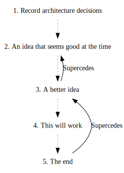

```bash
$ adr new An idea that seems good at the time
doc/service_b/0002-an-idea-that-seems-good-at-the-time.md
$ adr new -s 2 A better idea
doc/service_b/0003-a-better-idea.md
$ adr new This will work
doc/service_b/0004-this-will-work.md
$ adr new -s 3 The end
doc/service_b/0005-the-end.md

$ adr generate graph | dot -Tsvg > graph.svg
```
